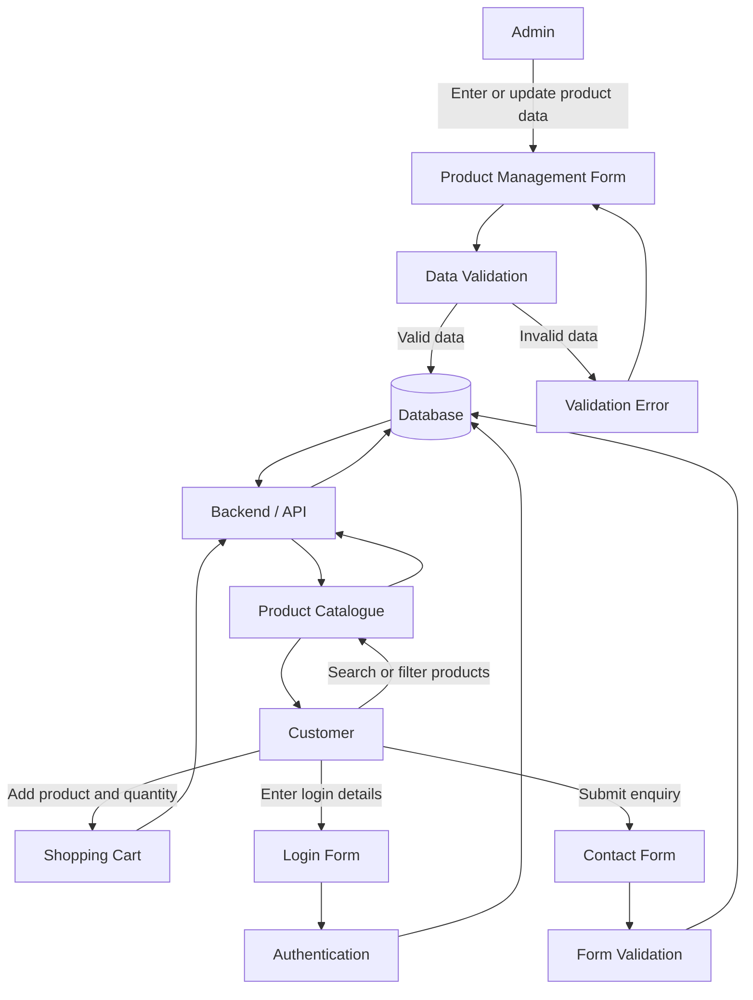

# Capstone B – Week 2
## Understanding the Data Behind Our Project

### Project
Secure Retail System

### Module
Product Catalogue

---

## 1. Review of Existing MVP

During Capstone A, our team developed a frontend MVP for the Secure Retail System. The existing system will be reviewed to identify the information currently displayed, entered and used within the Product Catalogue and related system features.

---

## 2. Project Data Inventory

## 2. Project Data Inventory

The following inventory identifies the main data required by the Secure Retail System, with a primary focus on the Product Catalogue module.

| Data Element | Description | Data Type | Source | Created/Entered By | Used By | Required |
|---|---|---|---|---|---|---|
| Product ID | Unique identifier for each product | Integer | System | System | Catalogue, Admin, Cart | Yes |
| Product Name | Name of the product | Text | Product Form | Admin | Customer, Admin | Yes |
| SKU | Unique stock/product code | Text | Product Form | Admin | Admin, System | Yes |
| Brand | Product brand | Text | Product Form | Admin | Customer, Admin | No |
| Category | Group the product belongs to | Text / ID | Product Form | Admin | Customer, System | Yes |
| Description | Detailed product information | Text | Product Form | Admin | Customer | Yes |
| Price | Selling price of the product | Decimal | Product Form | Admin | Customer, Cart | Yes |
| Stock Quantity | Number of items available | Integer | Inventory | Admin/System | Admin, Catalogue | Yes |
| Product Image | Image associated with the product | File Path / URL | Product Form | Admin | Customer | No |
| Product Status | Active, inactive or out of stock | Text / Boolean | System/Admin | System/Admin | Catalogue | Yes |
| Search Keyword | Text entered to search products | Text | User Input | Customer | Search Function | No |
| Selected Category | Category selected by the customer | Text / ID | User Input | Customer | Filter Function | No |
| Cart Quantity | Number of units selected | Integer | User Input | Customer | Cart | Yes when added |
| Customer Email | Email used for account/login | Text | User Input | Customer | Login/Account | Yes |
| Password | Customer authentication credential | Encrypted Text | User Input | Customer | Authentication | Yes |
| Contact Name | Name entered in contact form | Text | User Input | Customer | Admin/Support | Yes |
| Contact Email | Email entered in contact form | Text | User Input | Customer | Admin/Support | Yes |
| Contact Message | Customer enquiry | Text | User Input | Customer | Admin/Support | Yes |
| Created Date | Date a record was created | Date/Time | System | System | Admin/System | Yes |
| Updated Date | Date a record was last modified | Date/Time | System | System | Admin/System | Yes |

---

---

## 3. Data Sources and Responsibilities

The following table identifies where important project data originates and who is responsible for creating, updating and using that data within the Secure Retail System.

| Data | Source | Created/Entered By | Updated By | Used By |
|---|---|---|---|---|
| Product Information | Product Management Form | Admin | Admin | Customer, Admin |
| Product ID | System | System | System | Catalogue, Admin, Cart |
| Product Name | Product Management Form | Admin | Admin | Customer, Admin |
| SKU | Product Management Form | Admin | Admin | Admin, System |
| Category | Product Management Form | Admin | Admin | Customer, Catalogue |
| Price | Product Management Form | Admin | Admin | Customer, Cart |
| Stock Quantity | Inventory / Product Management | Admin | Admin / System | Catalogue, Admin |
| Product Status | Product / Inventory Data | Admin / System | Admin / System | Customer, Admin |
| Search Keyword | Search Bar | Customer | Customer | Search Function |
| Category Filter | Product Catalogue | Customer | Customer | Filter Function |
| Cart Quantity | Shopping Cart | Customer | Customer | Cart, System |
| Customer Email | Registration / Login Form | Customer | Customer | Authentication, Account |
| Password | Registration Form | Customer | Customer | Authentication System |
| Contact Name | Contact Form | Customer | Customer | Admin / Support |
| Contact Email | Contact Form | Customer | Customer | Admin / Support |
| Contact Message | Contact Form | Customer | Customer | Admin / Support |
| Created Date | System | System | System | Admin, System |
| Updated Date | System | System | System | Admin, System |
---

## 4. Data Flow Diagram

## 4. Data Flow Diagram

The following diagram shows how data moves through the Secure Retail System between the administrator, customer, application and database.

### Data Flow Explanation

1. The administrator enters or updates product information through the Product Management Form.
2. The system validates the entered information before storing it.
3. Valid product data is stored in the database.
4. The Backend/API retrieves product information from the database.
5. The Product Catalogue displays product information to customers.
6. Customers can search and filter products.
7. Customers can add products and quantities to the shopping cart.
8. Customers enter login details through the Login Form, which are processed by the authentication system.
9. Customers can submit enquiries through the Contact Form.
10. Form data is validated before being processed or stored.

---
## 5. Important Business Information

## 5. Important Business Information

The Secure Retail System requires important business information to support daily operations, customer service and future reporting. The Product Catalogue and related system features should provide accurate and useful information to both customers and administrators.

| Business Information | Why It Is Important |
|---|---|
| Total Number of Products | Helps administrators understand the size of the catalogue |
| Products by Category | Supports product organisation and filtering |
| Product Prices | Allows customers to view current selling prices |
| Stock Quantity | Helps monitor available inventory |
| Out-of-Stock Products | Helps administrators identify products that need restocking |
| Low-Stock Products | Supports inventory planning and stock control |
| Active / Inactive Products | Helps control which products are visible to customers |
| Product Search Results | Helps customers quickly find relevant products |
| Cart Information | Shows selected products, quantities and prices |
| Customer Account Information | Supports login and account management |
| Contact Enquiries | Allows administrators to respond to customer questions |
| Recently Added Products | Helps track new products added to the system |
| Recently Updated Products | Helps track changes made to catalogue information |

### Business Information Summary

This information can later be used to support reports, dashboards and management decisions. Accurate product, stock and customer information will help the Secure Retail System operate effectively and provide useful information to both customers and administrators.

---

## 6. Data Quality and Integrity Risks

## 6. Data Quality and Integrity Risks

Poor-quality, missing or invalid data can reduce the reliability of the Secure Retail System. The following risks were identified for the Product Catalogue and related system features.

| Data Risk | Example | Potential Impact | Suggested Control |
|---|---|---|---|
| Missing Product Name | A product is saved without a name | Customers cannot identify the product | Make product name mandatory |
| Invalid Price | A negative price or text is entered | Incorrect pricing and transaction errors | Accept only valid numeric values greater than or equal to 0 |
| Duplicate SKU | Two products use the same SKU | Inventory records may become confused | Require SKU to be unique |
| Negative Stock Quantity | Stock is entered as -5 | Incorrect availability information | Allow only zero or positive whole numbers |
| Missing Category | Product has no category | Search and filtering become inaccurate | Require a valid category |
| Incorrect Product Information | Wrong description, brand or price is entered | Customers receive misleading information | Allow authorised users to review and update records |
| Outdated Product Data | Old prices or stock values remain in the system | Customers see incorrect information | Record update dates and regularly review product data |
| Missing Product Image | Product has no image | Poor catalogue presentation | Use a placeholder image where necessary |
| Invalid Customer Email | Incorrect email format is entered | Login or contact communication may fail | Validate email format |
| Weak Password Handling | Password is stored insecurely | Security and privacy risk | Store passwords securely using hashing |
| Invalid Cart Quantity | Customer enters zero or negative quantity | Incorrect cart calculations | Require quantity to be at least 1 |
| Duplicate Product Records | Same product is created more than once | Catalogue becomes inconsistent | Check product ID and SKU uniqueness |
| Missing Contact Information | Customer submits an incomplete enquiry | Admin may be unable to respond | Make required contact fields mandatory |
| Invalid Data Type | Text is entered into a numeric field | System errors or incorrect calculations | Apply field-level data type validation |

### Data Risk Analysis Summary

The Secure Retail System depends on accurate and valid product, customer and transaction data. Validation rules, mandatory fields, unique identifiers, secure password handling and regular data updates can reduce the risk of incorrect or unreliable information. These controls will also support future database integrity and system security.

---

## 7. Data Requirements for Future Development

## 7. Data Requirements for Future Development

The information identified during Week 2 will guide future database, backend, API and reporting development for the Secure Retail System.

The Product Catalogue and related system features will require structured and validated data so that information can be stored, retrieved and updated reliably.

### Future Data Requirements

| Requirement | Description |
|---|---|
| Unique Product ID | Each product must have a unique identifier |
| Unique SKU | Each product should have a unique stock/product code |
| Product Information | Product name, brand, category, description and image must be stored |
| Price Data | Product prices must be stored as valid numeric values |
| Stock Data | Stock quantity must be stored and updated accurately |
| Product Status | The system should identify whether a product is active, inactive or out of stock |
| Customer Account Data | Customer name, email and secure password information will be required |
| Cart Data | Selected products, quantity and price information will be required |
| Contact Data | Customer enquiries should include name, email and message |
| Created Date | The system should record when important records are created |
| Updated Date | The system should record when important records are changed |
| Validation Rules | Required fields, data types and input formats must be validated |
| Secure Password Storage | Passwords must be stored securely using password hashing |
| Database Relationships | Product, customer, cart and other related data should be linked using appropriate identifiers |
| API Support | The backend/API should be able to retrieve and update required system data |
| Reporting Support | Stored data should support future reports and dashboards |

### Preparation for Database Design

The data identified in this analysis can later be organised into database tables such as:

- Products
- Categories
- Customers
- Cart
- Cart Items
- Contact Enquiries

Relationships between these tables will be designed during future database development.

### Week 2 Conclusion

Week 2 focused on understanding the information required by the Secure Retail System. The team identified important product, customer and system data, documented data sources and responsibilities, created a Project Data Inventory, developed a Data Flow Diagram and identified data quality and integrity risks.

This analysis provides a foundation for future database design, API development, reporting and backend implementation.

---

## 6. Data Quality and Integrity Risks

To be completed.

---

## 7. Data Requirements for Future Development

To be completed.
