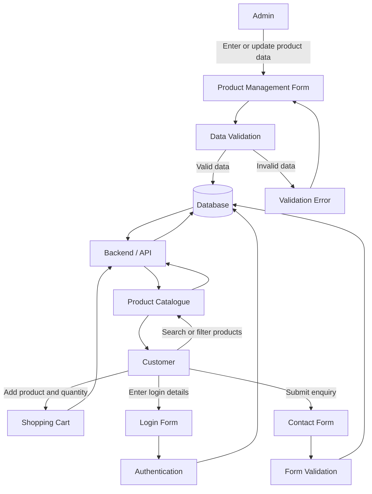

# Capstone B – Week 2
## Understanding the Data Behind Our Project

### Project
Secure Retail System

### Module
Product Catalogue

---

## 1. Review of Existing MVP

During Capstone A, our team developed a frontend MVP for the Secure Retail System. The existing system will be reviewed to identify the information currently displayed, entered and used within the Product Catalogue and related system features.

---

## 2. Project Data Inventory

## 2. Project Data Inventory

The following inventory identifies the main data required by the Secure Retail System, with a primary focus on the Product Catalogue module.

| Data Element | Description | Data Type | Source | Created/Entered By | Used By | Required |
|---|---|---|---|---|---|---|
| Product ID | Unique identifier for each product | Integer | System | System | Catalogue, Admin, Cart | Yes |
| Product Name | Name of the product | Text | Product Form | Admin | Customer, Admin | Yes |
| SKU | Unique stock/product code | Text | Product Form | Admin | Admin, System | Yes |
| Brand | Product brand | Text | Product Form | Admin | Customer, Admin | No |
| Category | Group the product belongs to | Text / ID | Product Form | Admin | Customer, System | Yes |
| Description | Detailed product information | Text | Product Form | Admin | Customer | Yes |
| Price | Selling price of the product | Decimal | Product Form | Admin | Customer, Cart | Yes |
| Stock Quantity | Number of items available | Integer | Inventory | Admin/System | Admin, Catalogue | Yes |
| Product Image | Image associated with the product | File Path / URL | Product Form | Admin | Customer | No |
| Product Status | Active, inactive or out of stock | Text / Boolean | System/Admin | System/Admin | Catalogue | Yes |
| Search Keyword | Text entered to search products | Text | User Input | Customer | Search Function | No |
| Selected Category | Category selected by the customer | Text / ID | User Input | Customer | Filter Function | No |
| Cart Quantity | Number of units selected | Integer | User Input | Customer | Cart | Yes when added |
| Customer Email | Email used for account/login | Text | User Input | Customer | Login/Account | Yes |
| Password | Customer authentication credential | Encrypted Text | User Input | Customer | Authentication | Yes |
| Contact Name | Name entered in contact form | Text | User Input | Customer | Admin/Support | Yes |
| Contact Email | Email entered in contact form | Text | User Input | Customer | Admin/Support | Yes |
| Contact Message | Customer enquiry | Text | User Input | Customer | Admin/Support | Yes |
| Created Date | Date a record was created | Date/Time | System | System | Admin/System | Yes |
| Updated Date | Date a record was last modified | Date/Time | System | System | Admin/System | Yes |

---

---

## 3. Data Sources and Responsibilities

The following table identifies where important project data originates and who is responsible for creating, updating and using that data within the Secure Retail System.

| Data | Source | Created/Entered By | Updated By | Used By |
|---|---|---|---|---|
| Product Information | Product Management Form | Admin | Admin | Customer, Admin |
| Product ID | System | System | System | Catalogue, Admin, Cart |
| Product Name | Product Management Form | Admin | Admin | Customer, Admin |
| SKU | Product Management Form | Admin | Admin | Admin, System |
| Category | Product Management Form | Admin | Admin | Customer, Catalogue |
| Price | Product Management Form | Admin | Admin | Customer, Cart |
| Stock Quantity | Inventory / Product Management | Admin | Admin / System | Catalogue, Admin |
| Product Status | Product / Inventory Data | Admin / System | Admin / System | Customer, Admin |
| Search Keyword | Search Bar | Customer | Customer | Search Function |
| Category Filter | Product Catalogue | Customer | Customer | Filter Function |
| Cart Quantity | Shopping Cart | Customer | Customer | Cart, System |
| Customer Email | Registration / Login Form | Customer | Customer | Authentication, Account |
| Password | Registration Form | Customer | Customer | Authentication System |
| Contact Name | Contact Form | Customer | Customer | Admin / Support |
| Contact Email | Contact Form | Customer | Customer | Admin / Support |
| Contact Message | Contact Form | Customer | Customer | Admin / Support |
| Created Date | System | System | System | Admin, System |
| Updated Date | System | System | System | Admin, System |
---

## 4. Data Flow Diagram

## 4. Data Flow Diagram

The following diagram shows how data moves through the Secure Retail System between the administrator, customer, application and database.

### Data Flow Explanation

1. The administrator enters or updates product information through the Product Management Form.
2. The system validates the entered information before storing it.
3. Valid product data is stored in the database.
4. The Backend/API retrieves product information from the database.
5. The Product Catalogue displays product information to customers.
6. Customers can search and filter products.
7. Customers can add products and quantities to the shopping cart.
8. Customers enter login details through the Login Form, which are processed by the authentication system.
9. Customers can submit enquiries through the Contact Form.
10. Form data is validated before being processed or stored.

---
## 5. Important Business Information

To be completed.

---

## 6. Data Quality and Integrity Risks

To be completed.

---

## 7. Data Requirements for Future Development

To be completed.
